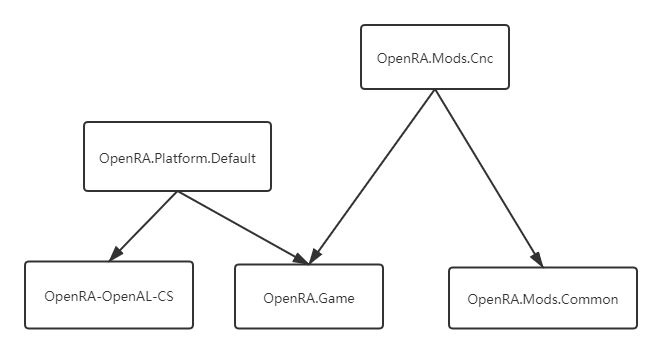
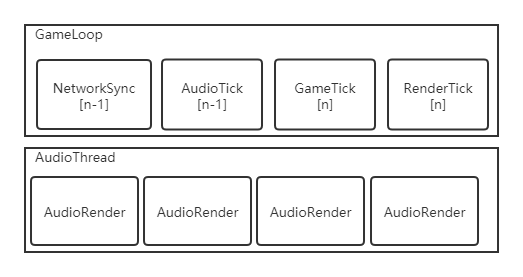

# OpenRA 音频系统分析

## 音频基本概念

### 音频格式

[Digital Audio Number Systems](https://www.dsprelated.com/freebooks/mdft/Number_Systems_Digital_Audio.html)

自然界的声音要经过数模转换器把震动的物理量转换为计算机存储的数字，这个数字的编码就是PCM。

[WAV格式](https://en.wikipedia.org/wiki/WAV) 

WAV格式是目前常见的无损音频存储格式，扩展名多为*.wav。它的文件结构也比较简单，历史数据格式也有很多种，详细可以参考[sndfile](http://www.mega-nerd.com/libsndfile/)上的表格

Bit Depth

用多少个bit来表示一个振幅采样脉冲，很多常见的音频文件存储的是16bit定点数，也就是动态范围最大96dB，如果能存储24bit定点数，动态范围可达144dB。

Channel Num

音频数据中包含多少个通道的数据，比如立体声是2，单声道是1

在存储文件和传输场景下，多数存储格式是交错式Interleaving，在实时渲染时，多数时Plannar，即存储一个n维数组，每一维的数组代表一个通道。

### OpenAL

[OpenAL](https://www.openal.org/)是一个OpenGL API风格的跨平台的3D音频库，包括算法和设备控制，在浏览器的WebAssembly中提供的音频设备接口就是基于OpenAL的。

### SpatialAudio

像3D图形系统一样，提供3D音频渲染能力，一个空间音频系统多数包括了：距离衰减 / 头相关滤波器 / 混响估计等模块。

 

## OpenRA内的音频系统分析

### 物理结构

**OpenRA.Mods.Cnc**

Cnc游戏的Mod实现，里面包含了Cnc自己的资源加载模块，里面实现了继承自ISoundLoader / ISoundFormat的AudLoader和VocLoader，分别用于音频和语音加载。目前只实现了ADPCM（一种老的PCM格式）的加载，还有一种叫“WestwoodCompressed“的格式还没支持。

 

**OpenRA.Mods.Common**

这里主要实现的是自定义的资源加载，继承了ISoundLoader / ISoundFormat

Mod基础支持库跟音频相关的是WAVLoader和WavFormat

 

**OpenRA.Game**

游戏基础逻辑的入口，包含了基础的声音处理逻辑

Sound / ISoundEngine / ISoundSource / SoundDevice / ISoundLoader / ISoundFormat

Sound类作为音频系统的实例放在Game类中，做全局声音控制，各个GameObject都直接调用Game.Sound来控制音频系统

 

**OpenRA.Platform.Default**

里面包括了平台相关的ISound/ISoundEngine/ISoundSource/SoundDevice实现，目前只有OpenAL的实现，具体OpenALSoundEngine怎么实现的不做深入探究，因为可能不会使用OpenAL的实现。这个模块是运行时动态加载的，所以构建依赖是分离的。

 

**OpenRA-OpenAL-CS**

OpenRA项目用的OpenAL C# binding，目前几个主要平台都包括了OpenAL的实现。

 

### 音频资源管理与加载

目前OpenRA只支持Wav格式的音频文件。

通过WavFormat+WavLoader在需要时一次全部载入内存，都做了异步加载策略，使用的时候再通过Loader加载到Cache中。

通过OpenAL的setBuffer指定PCM数据拿来回放

用Cache做延迟加载，使用文件名作为Key。

### 初始化流程

**实例创建**

Game.Initialize()

Sound = new Sound(); 

创建新的音频系统实例，这里做了音频设备创建。由于要创建OpenAL的Buffer资源，所以都在这一步创建了，通过一个Sound Pool对象管理Buffer资源，目前支持32最大回放数。

**参数设置**

Sound.setListenerPosition； 设置用户Listener到世界坐标的Center位置

Sound.VolumeModifier = 1.0f; 设置音量衰减为1.0（音量不变）

Game.InitializeMod 初始化Mod资源

Sound.Initialze 音频系统Loader初始化，用于后续的音频资源加载。

### 主GameLoop流程

**调用过程**

Game.Loop -> Game.LogicTick -> Game.InnerLogicTick

**处理顺序**

先处理网络的OrderManager,

然后Game.Sound.Tick(),

然后World.Tick()

最后World.TickRender()

### 声音画面渲染时序

 *由于只关注了音频部分，其他部分可能不准确，欢迎更正。*

从图中可以看到音频Tick由于在GameTick之后，所以只能更新到n-1时刻的参数，延迟1帧。但是这里有一个MusicComplete的回调，所以一旦音乐播放完成会立刻让GameTick知道，从而在同一时刻处理音乐播放事件。

### GamePlay中的流程 

这块只有播放音频的逻辑，里面写了各种Play函数来支持播放需求，最终实现都是：

Root播放函数：ISound Play(SoundType type, Player player, string name, bool headRelative, WPos pos, float volumeModifier = 1f, bool loop = false)

转向调用Engine的 ISound ISoundEngine.Play2D(ISoundSource soundSource, bool loop, bool relative, WPos pos, float volume, bool attenuateVolume)

 

**单纯的Play文件支持**

ISound Play(SoundType type, string name)

ISound Play(SoundType type, string name, WPos pos)

ISound Play(SoundType type, string name, float volumeModifier)

ISound Play(SoundType type, string name, WPos pos, float volumeModifier)

 

**带Loop控制功能的 Play** 

ISound PlayLooped(SoundType type, string name)

ISound PlayLooped(SoundType type, string name, WPos pos)

 

**播放通知音**

bool PlayNotification(Ruleset rules, Player player, string type, string notification, string variant)

会调用PlayPredefined来进一步拼接资源URI

 

**按照资源定义规则播放**

bool PlayPredefined(SoundType soundType, Ruleset ruleset, Player p, Actor voicedActor, string type, string definition, string variant, bool relative, WPos pos, float volumeModifier, bool attenuateVolume)

会根据RuleSet里的规则拼接URI传给FileSystem的Loader加载资源包，最后调用Play2D播放声音

 

**播放音乐**

void PlayMusic()

public void PlayMusic(MusicInfo m)

void PlayMusicThen(MusicInfo m, Action then)

这三个最后都会跳转到PlayMusicThen

只有它使用了ISound ISoundEngine.Play2DStream(Stream stream, int channels, int sampleBits, int sampleRate, bool loop, bool relative, WPos pos, float volume)

这里的then回调会从音频Tick中判断音乐是不是播放完了，完了之后在GameLoop的同一个线程里做Update

 

**Player播放？**

ISound PlayToPlayer(SoundType type, Player player, string name)

ISound PlayToPlayer(SoundType type, Player player, string name, WPos pos)

PlayToPlayer 这个Player信息其实并没用用到。

 

**主声音Bus**

Sound.SoundVolume

Sound.DisableWorldSounds

**主音乐Bus**

Sound.MusicVolume

Sound.MusicSeekPosition // 这个值只用作时间显示

### 其他支持功能

**设备管理**

Sound.AvailableDevices

**静音设置**

Sound.MuteAudio

Sound.UnmuteAudio

 

## ECS系统上的实现

如果我们不用spatial audio的话，直接用bevy播放就可以。

用spatial audio我们可以再集成spatial audio（比如Resonance），不过RTS类游戏可能不像FPS/RPG游戏对空间感要求比较高

 

如果想作为探索项目的话，可以看看Unity 2018年提出的：

[[Video\] ECS Track: Graph Driven Audio in an ECS World - Unite LA](https://www.youtube.com/watch?v=kDE-KxQBiYQ) 

[[slide\] ECS: Graph Driven Audio in an ECS World](https://www.slideshare.net/unity3d/ecs-graph-driven-audio-in-an-ecs-world-120673657)

 

但是目前OpenRA的原始素材里其实都是播放的特性，没有RTPC / Head Related的特性需要修改实时音频渲染。

 

### 从Bevy实现

**TBD**