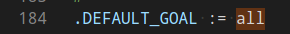
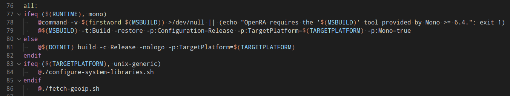
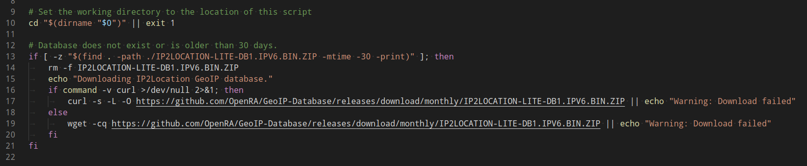
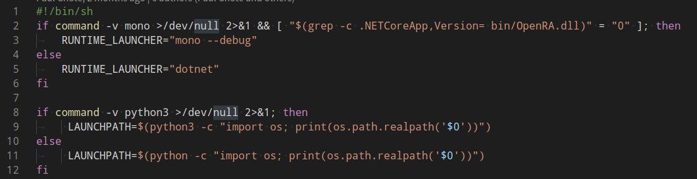
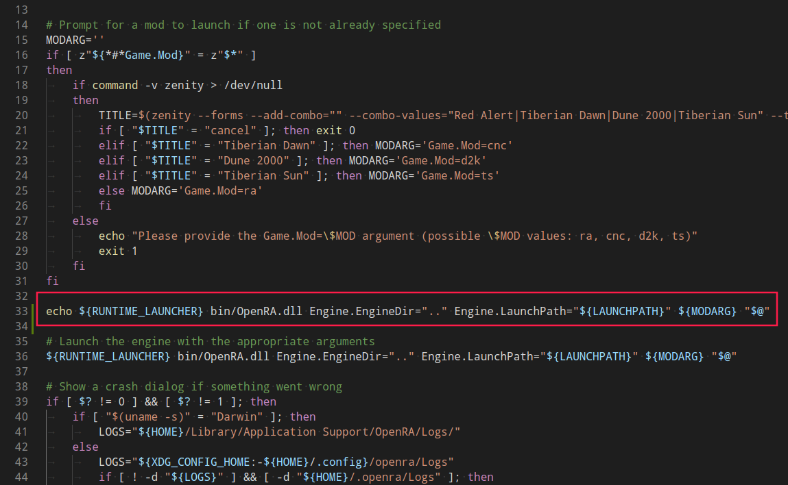
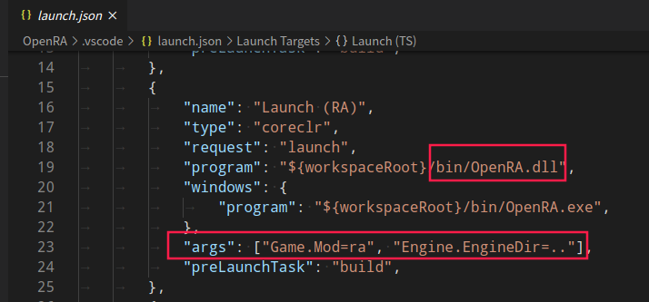
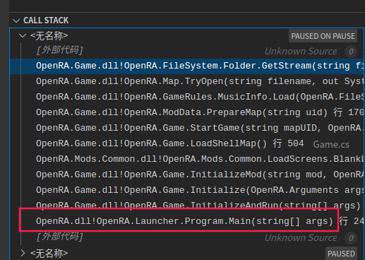

# 分析编译脚本及启动脚本

## OpenRA/Makefile

指定 all 为默认的执行目标

由于我用的是 dotnet 环境, 所以此处执行:

    @$(DOTNET) build -c Release -nologo -p:TargetPlatform=$(TARGETPLATFORM)

这里的 @ 指的是这行命令不显示在shell中, 我们去掉@, 在执行下 make, 在shell中可以看到执行的命令:

    dotnet build -c Release -nologo -p:TargetPlatform=linux-x64

可知: 编译成 Release 版本的, 为了调试, 所以此处我们修改成 Debug, 编译一遍

且 TARGETPLATFORM 为 linux-x64 --> 于是上面的 $(DOTNET) build .. 这条命令执行后, 执行:

    @./fetch-geoip.sh

我们可以看一下 fetch-geoip.sh 文件:

这是下载 IP2LOCATION-LITE-DB1.IPV6.BIN.ZIP 文件, 如果这个文件超过了30天 就删除重新下载, 用处: Download the IP2Location country database for use by the game server, 具体用处我不轻触, 看了下大小, 953K

综上:

    这个 all 目标执行的是: 1.编译  2.下载 ip地理位置 数据

## OpenRA/launch-game.sh

可以在第13行的位置添加一行命令:

    echo RUNTIME_LAUNCHER: $RUNTIME_LAUNCHER, LAUNCHPATH: $LAUNCHPATH

输出为:

    RUNTIME_LAUNCHER: dotnet, LAUNCHPATH: /develop/sources/OpenRA/launch-game.sh

这样就确定了 变量 RUNTIME_LAUNCHER 和 LAUNCHPATH 的值.

然后我们就看到了启动 OpenRA 的命令:

这里我加了一行, 输出下执行的命令:

    echo ${RUNTIME_LAUNCHER} bin/OpenRA.dll Engine.EngineDir=".." Engine.LaunchPath="${LAUNCHPATH}" ${MODARG} "$@"

在弹出来的对话框中, 我选择了: Red Alert

接着就进入了游戏, 同时输出了执行命令:

    dotnet bin/OpenRA.dll Engine.EngineDir=.. Engine.LaunchPath=/develop/sources/OpenRA/launch-game.sh Game.Mod=ra

## 调试

经过前面的两步分析, 我们确定了

    1. 编译命令:
        dotnet build -c Release -nologo -p:TargetPlatform=linux-x64

    2. 运行命令:
        dotnet bin/OpenRA.dll Engine.EngineDir=.. Engine.LaunchPath=/develop/sources/OpenRA/launch-game.sh Game.Mod=ra

为了调试, 我们手动修改 编译命令中的 "Release" 为 Debug, 重新编译执行: make

突然, 就看到了 OpenRA/.vscode/launch.json 文件, 点开一看, 刚好是 调试上面的 运行命令:

执行调试, 进入调试后, 程序跑起来后 快速的 暂停调试, 这时候根据 调试窗口的栈, 可以看到程序的入口:

    OpenRA.Launcher/Program.cs:21:Main

