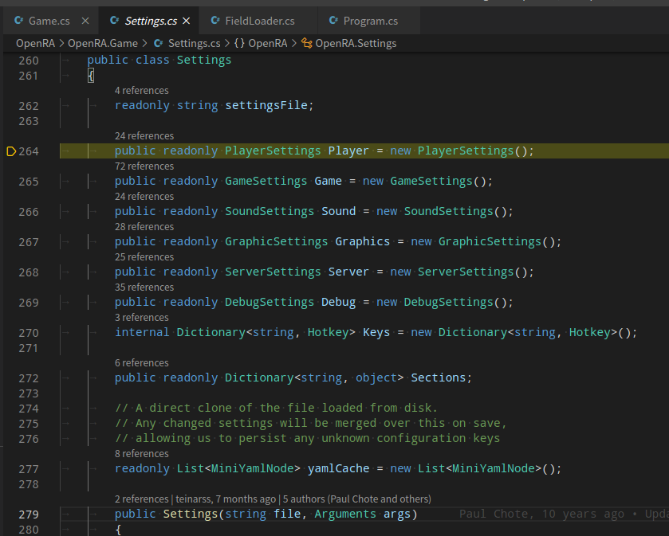

# 源码分析

ps: 这里我以 缩进即为向函数内部调用 的形式, 方便理解

启动命令:

    dotnet bin/OpenRA.dll Engine.EngineDir=.. Engine.LaunchPath=/develop/sources/OpenRA/launch-game.sh Game.Mod=ra

入口地址:

    OpenRA.Launcher/Program.cs:21:Main

    在Program.Main 中,
        Game.InitializeAndRun(args):
            Initialize(new Arguments(args)):
                设置 引擎路径: 
                    Platform.engineDir = ..
                    Platform.engineDirAccessed = true;
                初始化配置:
                    InitializeSettings(args):
                        Game.Settings = new Settings(Path.Combine(Platform.SupportDir, "settings.yaml"), args);
                        Platform.SupportDir 这里是: ~/.config/openra
                            看一下 Settings 结构:

                            这里包含了很多的配置信息: 玩家设置, 游戏设置, 声音设置, 图形设置, 服务器设置, Debug设置, 等等信息
                            如果存在 ~/.config/openra/settings.yaml 文件
                                读取这个文件, 遍历其中的每一个section
                                    加载section信息 到 相应的settings中.
                                    若某个段中的信息是空的, 则使用默认的构造函数中初始值, 再把这些信息加载到settings对象中

                    接着添加很多的日志channel:
                        Log.AddChannel("perf", "perf.log");
                        Log.AddChannel("debug", "debug.log");
                        Log.AddChannel("server", "server.log", true);
                        Log.AddChannel("sound", "sound.log");
                        Log.AddChannel("graphics", "graphics.log");
                        Log.AddChannel("geoip", "geoip.log");
                        Log.AddChannel("nat", "nat.log");
                        Log.AddChannel("client", "client.log");

                        在 Log.AddChannel 中:
                            可以看到 log目录是: ~/.config/openra/Logs
                            目录下看到了很多log文件:
                                client.log  debug.log  geoip.log  graphics.log  install.log  lua.log  nat.log  perf.log  server.log  sound.log  traitreport.log
                            Channels.Add(channelName,
                                new ChannelInfo
                                {
                                    Filename = filename,
                                    IsTimestamped = isTimestamped,
                                    Writer = TextWriter.Synchronized(writer)
                                });
                            这个过程就是 给一个log目录, 同时确定每一个日志文件, 给一个log文件的writer, 关联到 一个 channelName, 通过 channelName 去读写log

                        接着 加载平台特定的库:
                            
                            rendererPath = Path.Combine(Platform.BinDir, "OpenRA.Platforms." + p + ".dll");
                            获取到一个 loader = new AssemblyLoader(rendererPath)
                            在 loader Invoke 后, 得到 platform 对象
                            有 platform, 并根据settings, 就可以得到 渲染对象, 声音对象:
                            
                            Renderer = new Renderer(platform, Settings.Graphics):
                                这个实例化的过程也做了很多事情, 比如创建 window (真的窗口, 全屏的那种, 暂时不会动), 及WorldSpriteRenderer WorldRgbaSpriteRenderer WorldRgbaColorRenderer SpriteRenderer 等等
                            
                            Sound = new Sound(platform, Settings.Sound);
                                这里面 soundEngine = platform.CreateSound(soundSettings.Device):
                                    OpenAlSoundEngine(device), 这里大概可以选择不同的声音设备吧:
                                        device = ALC10.alcOpenDevice(deviceName);
                            
                        接着 InstalledMods(), 加载内部mod
                            目录是: OpenRA/bin/../mods
                        
                        ExternalMods = new ExternalMods() 加载外部mod:
                            这个过程会读取 ~/.config/openra/ModMetadata下的yaml
                                若存在, 则加载为 ExternalMods 的 mods 信息, 不存在 则跳过
                        
                        ExternalMods.Register(Mods[modID], launchPath, launchArgs, ModRegistration.User):
                            使用mods/ra下的资源(读出的二进制数据), 比如图标, RA, 版本, 启动参数, 等等, 加载到 一个 yaml 对象的节点中
                            把这个 yarm 数据写入到 ~/config/openra/ModMetadata/ra-{DEV_VERSION}.yarm
                            这里的文件名是: mod.Id 和 mod.Metadata.Version 的组合, mod对象来自 mods/ra/mod.yaml
                            LoadMod(yaml.Value, forceRegistration: true);
                                mod.Icon = sheetBuilder.Add(new Png(stream));
                                mod.Icon2x = sheetBuilder.Add(new Png(stream), 1f / 2);
                                ...
                                mods[key] = mod;

                        InitializeMod(modID, args); 初始化mod
                            
                            这里做了很多事情, 主要是 加载 mods/ra/mod.yaml 中配置的东西, 比如 Assemblies (dll文件)

                            ModData = new ModData(Mods[mod], Mods, true);
                            
                                ModFiles.LoadFromManifest(Manifest);
                                    从mod.yaml定义的packages下的目录下所有文件 记录到 fileIndex 中
                                        ~开头 表示 optional
                                        $开头, 表示一个mod
                                        ra|bits, 表示ra下的子路径
                                
                                Manifest.LoadCustomData(ObjectCreator);
                                    加载 除 reservedModuleNames 定义之外的数据
                                
                                LoadScreen = ObjectCreator.CreateObject<ILoadScreen>(Manifest.LoadScreen.Value); 得到 mod.yaml 中的 LoadScreen 数据
                                LoadScreen.Init..
                                LoadScreen.Display();

                                SoundLoaders
                                SpriteLoaders
                                VideoLoaders

                                Hotkeys

                            ModData.InitializeLoaders(ModData.DefaultFileSystem);
                            Renderer.InitializeFonts(ModData);
                            JoinLocal();
                            
                            ModData.LoadScreen.StartGame(args); 重点来了, 打开 下载MOD 窗口
                                获取 mod.yaml 中的窗口定义: ModContent节点
                                    检查 这个节点下 的 Packages, 就可以知道需不需要下载资源

            Run:
                Loop():

